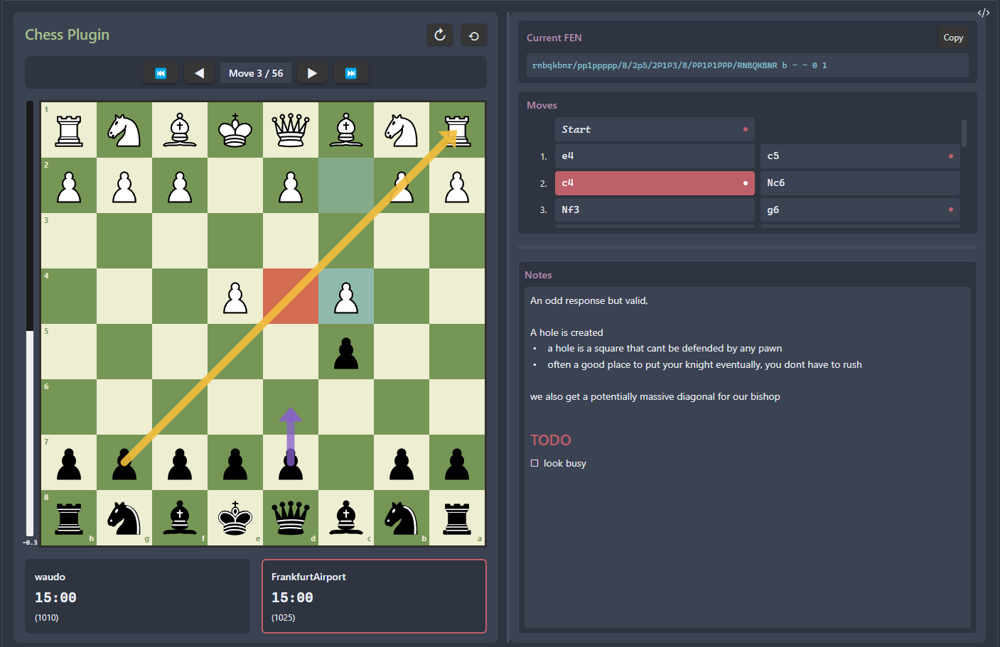
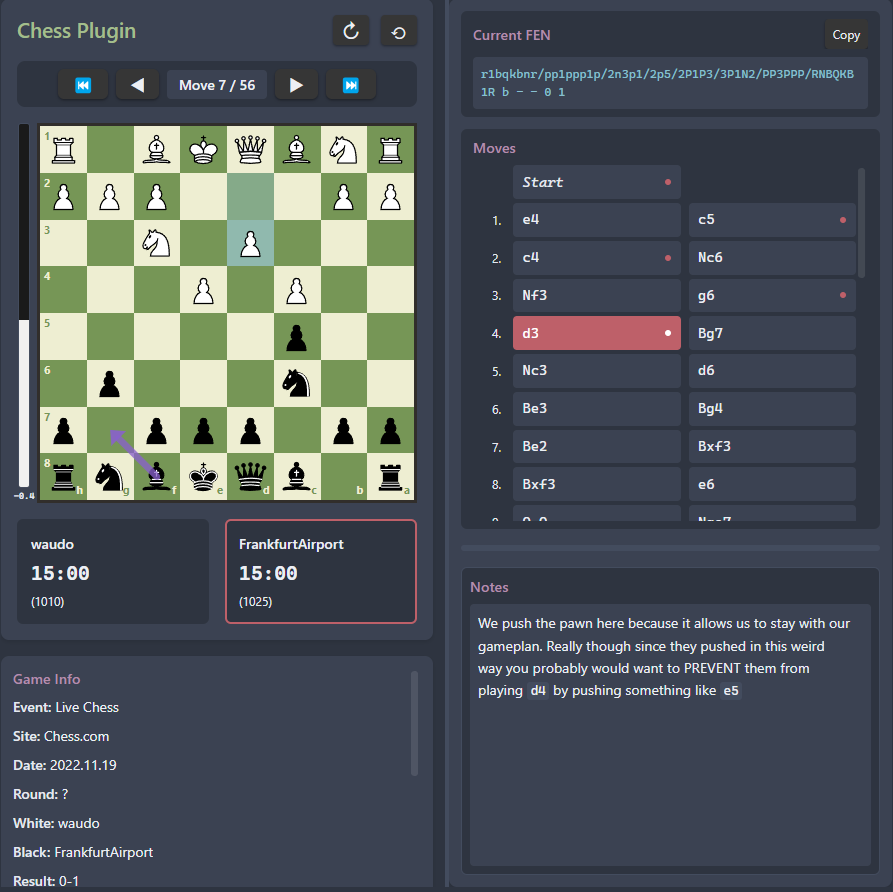
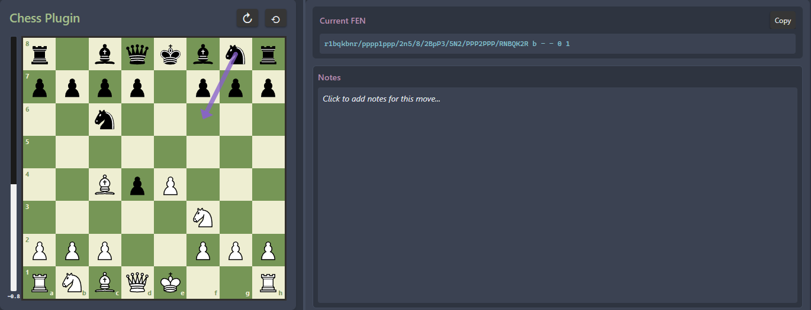

# Chess Analysis

An interactive chess analysis plugin for Obsidian that allows you to analyze games using **PGN (Portable Game Notation)** and **FEN (Forsyth-Edwards Notation)** directly in your notes.

## Features

### PGN Support
Analyze complete chess games using standard PGN notation with:
- **Interactive chess board** with move navigation
- **Move list** showing algebraic notation for all moves
- **Game annotations** including comments, variations, and analysis
- **Board flip** to view from either player's perspective
- **Custom board sizing** and responsive layout
- **Move-by-move playback** with navigation controls





### FEN Support
Display any chess position using FEN notation:
- **Position analysis** from any game state
- **Tactical puzzles** and training positions
- **Custom positions** for analysis and discussion
- **Interactive board** with all standard features



### Additional Features
- **Chess engine analysis** with evaluation scores and best move suggestions
- **Draw arrows and highlights** to annotate positions
- **Add notes** to specific moves for analysis
- **Drag-and-drop pieces** to explore variations
- **Resizable panels** for customized layout
- **Mobile and desktop support** with touch-friendly controls
- **Persistent state** - your annotations and board state are saved automatically

## Installation

### From Obsidian Community Plugins
1. Open Obsidian Settings
2. Go to **Community Plugins** and disable Safe Mode
3. Click **Browse** and search for "Chess Analysis"
4. Install the plugin and enable it

### Manual Installation
1. Download the latest release from [GitHub releases](https://github.com/bbwfan85/chess-analysis/releases)
2. Extract the files to your vault's `.obsidian/plugins/chess-analysis/` directory
3. Reload Obsidian and enable the plugin in Settings → Community Plugins

## Usage

### Using PGN Notation

Create a code block with the `chess` language identifier and paste your PGN:

````markdown
```chess
[Event "World Championship"]
[Site "New York"]
[Date "1886.??.??"]
[Round "1"]
[White "Steinitz, Wilhelm"]
[Black "Zukertort, Johannes"]
[Result "1-0"]

1. e4 e5 2. Nf3 Nc6 3. Bb5 a6 4. Ba4 Nf6 5. O-O Be7
6. Re1 b5 7. Bb3 d6 8. c3 O-O 9. h3 Na5 10. Bc2 c5
11. d4 Qc7 12. Nbd2 cxd4 13. cxd4 Nc6 14. Nb3 a5
15. Be3 a4 16. Nbd2 Bd7 17. Rc1 Qb7 18. Nf1 Rfc8
19. Bb1 Qb6 20. Ne3 Rab8 21. Qd3 Rc7 22. Rc2 Rbc8
23. Rec1 h6 24. Rxc6 1-0
```
````

### Using FEN Notation

For specific positions, use FEN notation:

````markdown
```chess
rnbqkbnr/pp1ppppp/8/2p5/4P3/5N2/PPPP1PPP/RNBQKB1R b KQkq - 1 2
```
````

### Minimal PGN Example

You can also use just the moves without headers:

````markdown
```chess
1. e4 e5 2. Nf3 Nc6 3. Bb5 a6 4. Ba4 Nf6 5. O-O
```
````

## Controls

### Navigation
- **← / →** - Navigate between moves
- **First / Last** buttons - Jump to start or end of game
- **Click moves** in the move list to jump to that position

### Annotations
- **Draw arrows** - Click squares in sequence to draw directional arrows
- **Highlight squares** - Click to highlight important squares
- **Add notes** - Use the notes panel to annotate specific positions
- **Clear annotations** - Remove arrows and highlights for current position

### Board Interaction
- **Flip board** - Toggle to view from either perspective
- **Resize panels** - Drag panel edges to adjust layout
- **Drag pieces** - Explore variations by moving pieces manually
- **Engine analysis** - Enable in settings for position evaluation

## Settings

Access plugin settings through Obsidian Settings → Chess Analysis:

- **Default Board Size** - Set initial board dimensions (pixels)
- **Default Board Orientation** - Start with board normal or flipped
- **Enable Chess Engine** - Turn on/off position analysis
- **Engine Depth** - Analysis depth (higher = better but slower)
- **Animation Duration** - Speed of piece movement animations

## Advanced Features

### Annotations and Notes
All annotations (arrows, highlights, and notes) are saved automatically within your markdown file. This means:
- Your analysis persists across Obsidian sessions
- Annotations are version-controlled with your vault
- You can share annotated games by sharing the markdown file

### Engine Analysis
When enabled, the chess engine provides:
- Position evaluation in centipawns
- Best move suggestions with visual indicators
- Real-time analysis as you navigate through moves

### Custom Positions
After loading a PGN or FEN, you can drag pieces to explore variations. The plugin tracks your custom moves and allows you to analyze positions not in the original game.

## Tips

1. **Studying Games** - Use PGN from your favorite games and add notes to key positions
2. **Tactical Training** - Create FEN positions from puzzle books or online resources
3. **Game Analysis** - Export your own games as PGN and analyze them with the engine
4. **Teaching** - Create instructional notes with annotated games for students
5. **Opening Preparation** - Study opening lines with annotations and variations

## Compatibility

- **Minimum Obsidian Version**: 0.15.0
- **Platforms**: Desktop (Windows, macOS, Linux) and Mobile (iOS, Android)
- **Live Preview**: Fully compatible with Obsidian's live preview mode

## Support

If you encounter issues or have suggestions:
- Report bugs on [GitHub Issues](https://github.com/bbwfan85/chess-analysis/issues)
- Check existing issues for solutions
- Include your Obsidian version and example PGN/FEN when reporting bugs

## Credits

Developed by [bbwfan85](https://github.com/bbwfan85)

Built with:
- [Stockfish](https://stockfishchess.org/) - Chess engine
- Obsidian Plugin API

## License

MIT License - see LICENSE file for details
